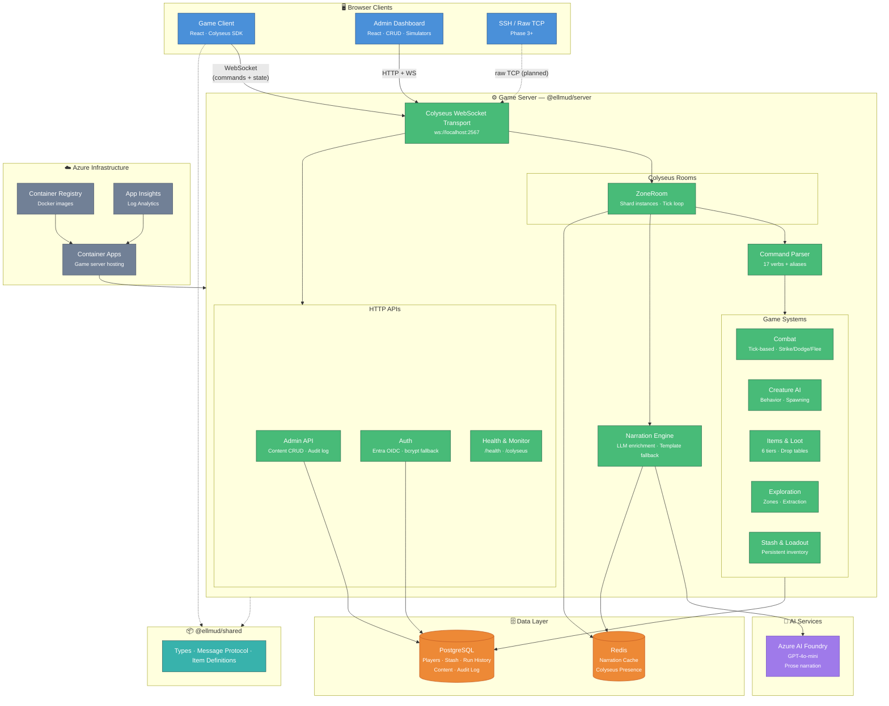

# Ellmud

**PvPvE Extraction RPG — Real-Time MUD**

Explore persistent zones and procedurally generated shards. Scavenge gear, fight creatures, manage your stash in the Refuge, then dive into extraction runs before collapse. Everything you don't extract, you lose.

## Quick Start

### Prerequisites
- **Node.js** ≥ 20.0.0 (see `.nvmrc`)
- **Docker** (for PostgreSQL, Redis; optional for Phase 1 in-memory mode)

### Local Development Setup

```bash
# 1. Clone and set up Node.js
git clone https://github.com/dkirby-ms/ellmud.git
cd ellmud
nvm use           # reads .nvmrc

# 2. Install dependencies
npm install

# 3. Start PostgreSQL and Redis (optional but recommended for Phase 2+)
docker compose up -d

# 4. Configure environment (copy template, or use defaults)
cp .env.example .env  # optional; defaults work for local dev

# 5. Build all packages
npm run build

# 6. Start the server and client
npm run dev:server    # Server: ws://localhost:2567
npm run dev:client    # Client + Admin: http://localhost:3000
```

**Access Points:**
- **Game Client:** http://localhost:3000 (React app with login/chat/gameplay)
- **Admin Dashboard:** http://localhost:3000/admin (content CRUD, audit log, simulators, deploy)
- **Server Health:** http://localhost:2567/health
- **Colyseus Monitor:** http://localhost:2567/colyseus (real-time room state)

## Architecture



> **How to read this:** Arrows show data flow. Solid lines = active today; dashed lines = planned or compile-time dependency.

**Design Principles:**
- **Server-Authoritative:** All game state changes are validated on the server. The client never mutates state directly.
- **Narrated Prose:** Players receive rich text descriptions of events — never raw state data. The LLM enriches templates asynchronously with fallback on timeout.
- **Monorepo:** Three packages — `shared` (types/protocol), `server` (Colyseus game server), and `client` (React web app) — built and deployed together.
- **Admin Interface:** Direct API access to all content types, full audit trail, and live metric dashboards.
- **Auth:** Microsoft Entra External ID (OAuth/OIDC) for production, with bcrypt-based local auth for development.

## Documentation

| Document | Description |
|----------|-------------|
| [Architecture Overview](docs/architecture.md) | System boundaries, data flow, component map |
| [Setup Guide](docs/setup.md) | Local development, env vars, running tests, Docker services |
| [API Reference](docs/api-reference.md) | WebSocket protocol, commands, HTTP endpoints |
| [LLM Integration](docs/llm-integration.md) | Narration pipeline, prompts, caching, templates |
| [Player Guide](docs/player-guide.md) | How to play, commands, combat, extraction |
| [Admin Guide](docs/admin-guide.md) | Dashboard, debugging, configuration, audit log |
| [Game Design Document](GDD.md) | Authoritative game design specification |

## Project Structure

```
packages/
├── shared/   # @ellmud/shared — types, message protocol, item system
├── server/   # @ellmud/server — Colyseus game server, admin APIs
└── client/   # @ellmud/client — React web app (game + admin dashboard)
```

## Tech Stack

- **Runtime:** Node.js 20+ / TypeScript
- **WebSocket:** Colyseus 0.17.x
- **Auth:** Microsoft Entra External ID (OAuth/OIDC) + bcrypt fallback
- **Database:** PostgreSQL (pg driver, raw SQL)
- **Cache:** Redis (presence, narration cache)
- **Admin UI:** React 18 + Vite + Tailwind CSS
- **LLM:** Azure AI Foundry (GPT-4o-mini)
- **Testing:** Vitest
- **Deployment:** Azure Container Apps + GitHub Actions

## Phase Status

### Phase 1 ✅ (Solo Extraction Loop)
- ✅ Colyseus rooms (ShardRoom, RefugeRoom)
- ✅ Command parser (17 verbs + aliases)
- ✅ Tick-based combat (strike, dodge, flee)
- ✅ Creature AI (Drowned Revenant)
- ✅ Extraction mechanic (5-tick channel)
- ✅ Item system (17 items, 6 tiers)
- ✅ Stash persistence
- ✅ LLM narration pipeline (cache + templates + Azure AI)
- ✅ Username/password auth
- ✅ Admin monitor dashboard (Colyseus)

### Phase 2 ✅ (Multiplayer + React Client)
- ✅ Multiplayer shard support (WebSocket room per shard)
- ✅ React game client (login, character select, gameplay UI)
- ✅ React admin dashboard (content CRUD for 11 entity types)
- ✅ PostgreSQL persistence (players, stash, items, skills, factions, run history)
- ✅ Redis cache + Colyseus presence for scaling
- ✅ WebSocket room APIs (pause/resume, spawn, live telemetry)

### Phase 2.5 ✅ (Admin Features + Deployment)
- ✅ Admin CRUD wiring (creatures, items, biomes, modifiers, loot tables, skills, factions, rooms, narrative templates)
- ✅ User management (add, edit, delete users; role-based admin permissions)
- ✅ Audit log with filtering (tracks all admin actions: creates, updates, deletes)
- ✅ Loot drop simulator (test loot distribution across creatures)
- ✅ Creature stat re-roll simulator (verify creature stat rolls)
- ✅ Deploy page (preview diffs, promote to staging/production)
- ✅ Microsoft Entra External ID integration (OAuth/OIDC login)
- ✅ Admin search and notifications (quick entity lookup, validation warnings)

### Phase 3 🔄 (Planned)
- 🔄 SSH/Raw TCP client adapter (legacy MUD client support)
- 🔄 Advanced creature AI (behavior trees, multi-phase encounters)
- 🔄 PvP system (arenas, contracts, faction warfare)
- 🔄 Content expansion (more biomes, creature types, static zones, procedural events)
- 🔄 Performance optimization (creature AI off-thread, narrative batching)

## Environment Variables

See `.env.example` for defaults. Common variables:

| Variable | Default | Description |
|----------|---------|-------------|
| `PORT` | `2567` | Server listen port |
| `CLIENT_URL` | `http://localhost:3000` | React client URL (for Entra redirects) |
| `ENTRA_CLIENT_ID` | *(none)* | Microsoft Entra External ID client ID |
| `ENTRA_CLIENT_SECRET` | *(none)* | Microsoft Entra External ID secret |
| `ENTRA_TENANT_ID` | *(none)* | Microsoft Entra tenant ID |
| `ALLOW_LOCAL_AUTH` | `true` | Allow local username/password login |
| `DATABASE_URL` | *(none)* | PostgreSQL connection string |
| `REDIS_PRESENCE_ENABLED` | `false` | Enable Redis for multi-replica scaling |
| `REDIS_CONNECTION_STRING` | `redis://localhost:6379` | Redis connection string |
| `AZURE_ENDPOINT` | *(none)* | Azure AI Foundry endpoint |
| `AZURE_API_KEY` | *(none)* | Azure AI Foundry API key |
| `AZURE_DEPLOYMENT_NAME` | `gpt-4o-mini` | LLM deployment name |
| `LOG_LEVEL` | `info` | Logging level (debug, info, warn, error) |
| `ADMIN_TOKEN` | *(random UUID)* | Admin API secret token |

## License

ISC
